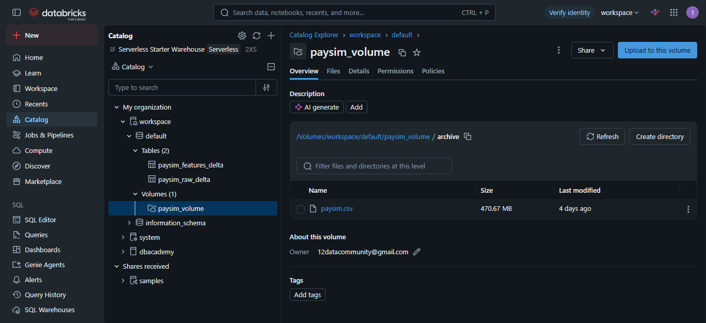
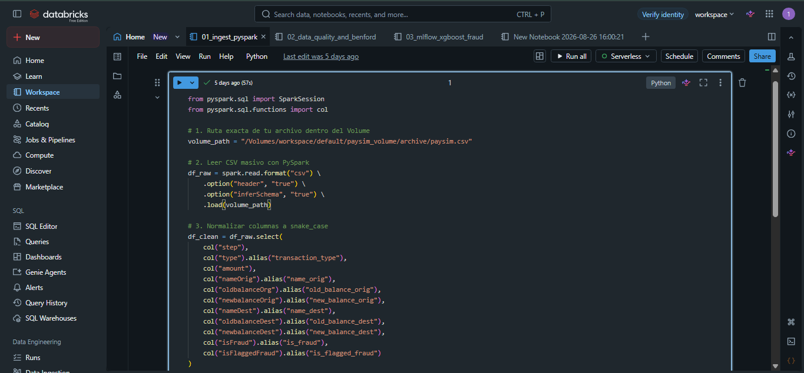
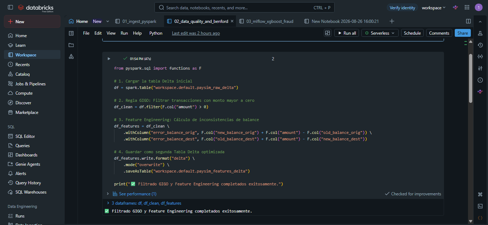
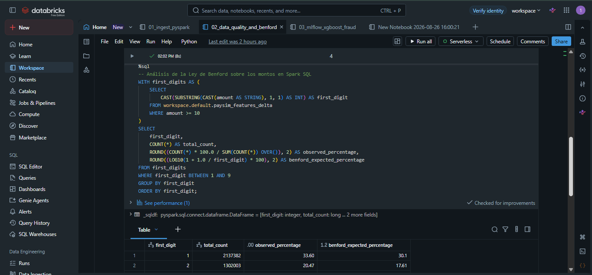
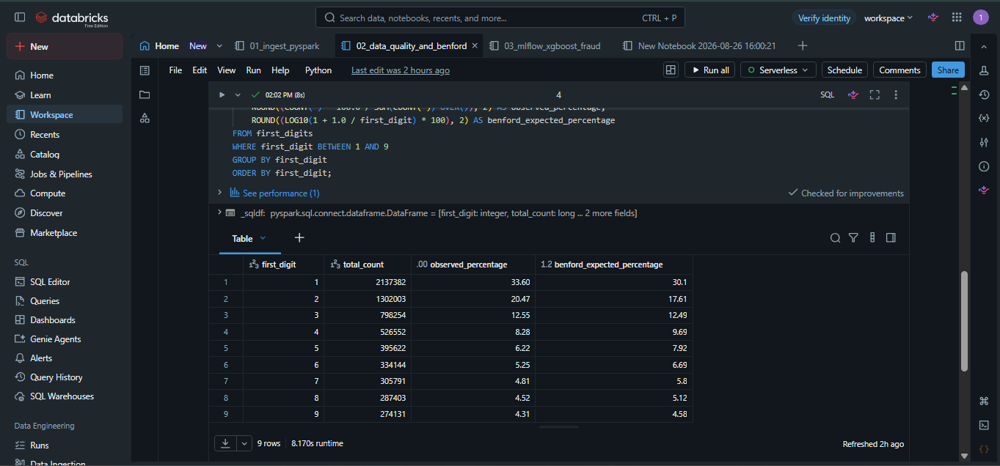
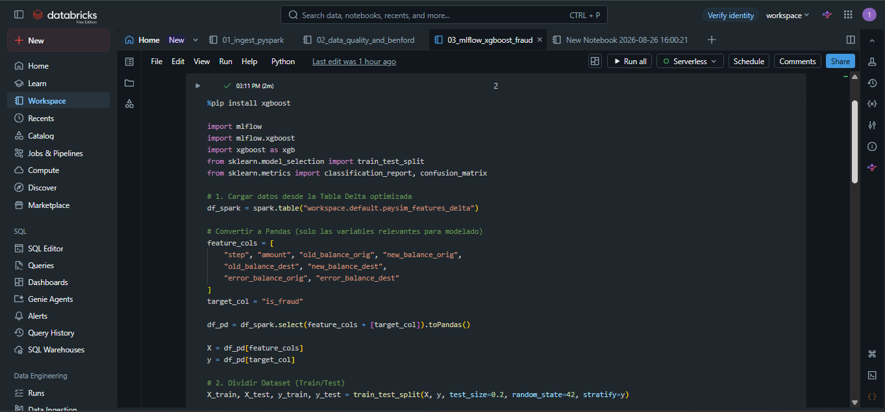
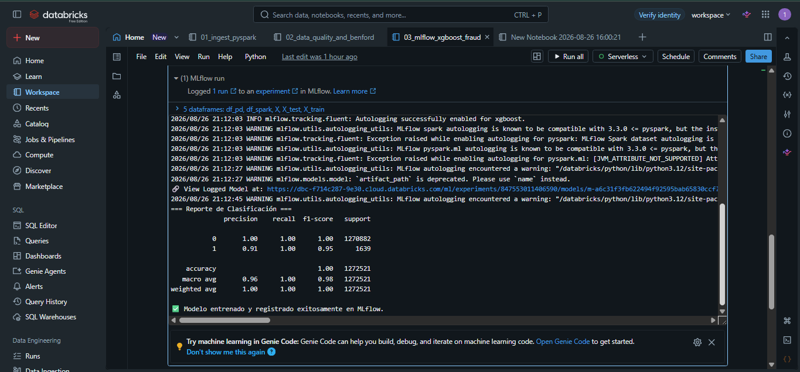
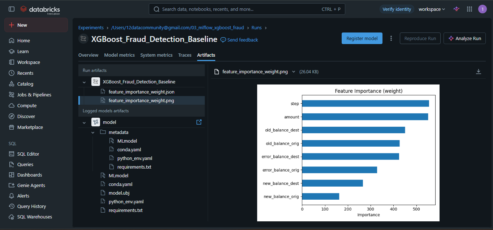

# PaySim Financial Fraud Detection & MLOps Pipeline (Databricks + Delta Lake + PySpark)

Este proyecto implementa una solución de procesamiento masivo de datos y aprendizaje automático distribuido para la detección de fraudes financieros utilizando el ecosistema de **Databricks**, **Unity Catalog**, **PySpark**, **Delta Lake** y **MLflow**.

Solución integral de procesamiento masivo de datos y Machine Learning distribuido para la detección de fraudes financieros. El proyecto implementa la arquitectura Medallion sobre el ecosistema de **Databricks**, aprovechando **Unity Catalog**, **PySpark**, **Delta Lake** y **MLflow Tracking**.

---

## 🛠️ Arquitectura de la Solución

1. **Ingesta de Datos (Unity Catalog & PySpark):** Carga masiva del dataset PaySim almacenado en Volumes de Unity Catalog a Tablas Delta optimizadas.
2. **Ingesta Masiva:** Carga distribuida con PySpark desde Unity Catalog Volumes a Delta Lake.
3. **Calidad de Datos & Análisis Estadístico (GIGO & Benford):** Filtrado de registros inconsistentes (GIGO), ingeniería de características para errores de balance y validación de anomalías mediante la **Ley de Benford** ejecutada en Spark SQL.
4. **Feature Engineering:** Cálculo de inconsistentencias en balances de origen y destino (`error_balance_orig`, `error_balance_dest`).
5. **Modelado Machine Learning & MLOps (XGBoost + MLflow):** Entrenamiento de un clasificador XGBoost manejando desbalance de clases, con seguimiento automático de experimentos, hiperparámetros y artefactos registrados mediante **MLflow Tracking**.
6. **MLOps Pipeline:** Registro centralizado de experimentos, esquemas y modelos empaquetados mediante MLflow.

---

## 📸 Evidencia de Ejecución en Databricks

### 1. Ingesta de Datos y Unity Catalog (Fase 1)

Carga masiva del dataset PaySim desde los **Volumes** de Unity Catalog hacia la primera Tabla Delta optimizada (`paysim_raw_delta`).



_Ejecución del Notebook `01_ingest_pyspark` creando la estructura base en PySpark:_



---

### 2. Calidad de Datos (GIGO) y Análisis de Benford (Fase 2)

Filtrado de transacciones inválidas, creación de variables de error de balance y verificación estadística de fraudes mediante la **Ley de Benford** en Spark SQL.



_Resultados de la distribución del primer dígito comparados contra la expectativa teórica:_





---

### 3. Modelado XGBoost y MLflow Tracking (Fase 3)

Entrenamiento del modelo clasificador ajustando el desbalance de clases (`scale_pos_weight`) y registro automático de parámetros, métricas y artefactos.



_Matriz de importancia de características (`Feature Importance`) generada y registrada como artefacto en MLflow:_



## 📊 Métricas del Modelo

| Métrica       | Clase 0 (Legítimo) | Clase 1 (Fraude) |
| :------------ | :----------------: | :--------------: |
| **Precision** |        1.00        |     **0.91**     |
| **Recall**    |        1.00        |     **1.00**     |
| **F1-Score**  |        1.00        |     **0.95**     |

_Registro del experimento, modelo serializado (`model.ubj`) y dependencias en MLflow:_



---

## 📁 Estructura del Repositorio

```text
proyectoQL_DBFS/
├── assets/                  # Fotos del proyecto (.png)
├── docs/                    # Documentación adicional
├── notebooks/               # Respaldos de libretas de Databricks
├── src/                     # Scripts ejecutables en Python / PySpark
│   ├── 01_ingest_pyspark.py
│   ├── 02_data_quality_benford.py
│   └── 03_mlflow_xgboost_fraud.py
├── .gitignore
├── README.md
└── requirements.txt
```
